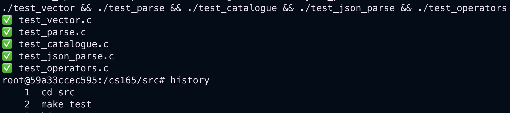
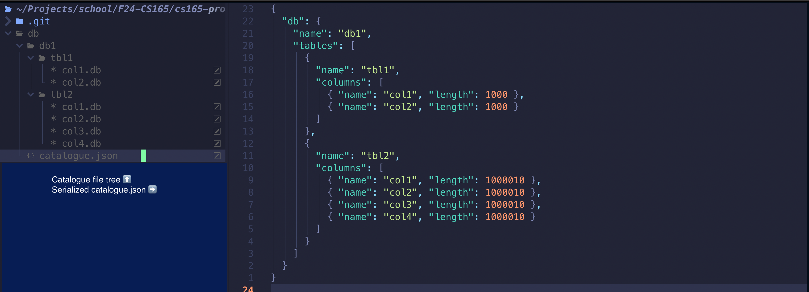

# Milestone 1

_Note: This doc is more reflective than suggestive because I’m mostly finished with Milestone 1 when writing it._

### Introduction

My goal for milestone 1 was to build a working prototype for an integer column store database optimized for analytic workloads. This required building and rewriting structures for client i/o, server i/o, query parsing, query execution, catalogue management, and durable storage. This code frequently ignored marginal performance in favor of iteration speed. In particular, I spent very little time optimizing operators beyond design decisions that will hopefully make my system extendable later.

### Problems

- Testing: The DB needed a consistent local framework for unit and system tests.
- Query parsing: Inbound queries needed consistent, intuitive, safe, and scalable parsing.
- Operators: Every query needs one or more execution operators.
- Variable pool: Intermediate results must be persisted between user commands.
- Catalog: DB assets must be managed during runtime and persisted after shutdown.
- Client i/o: The client needed to support more than one outbound query per user input.

### Technical descriptions

- Testing

  - This was the first big change I introduced. In Rust, unit and integration tests are baked into the build system, and I wanted to replicate some of that experience for my C database. The goal was to enable adding and running tests as the main validation step throughout the dev cycle. This is particularly useful for isolating issues and detecting memory errors early on.
  - The src directory now has `test_*.c` files for every module with unit tests, and the makefile builds and runs all these via `make test`. Above that, I added a `test.sh` bash script mimicking the grading server for system tests. I also added a valgrind function to `bashrc` to simplify memory checking and a `debug.sh` script to run arbitrary queries and see their output.
    

- Query parsing
  - Most of the work in M1 was parsing new queries. I wanted a structure that was (1) easy to extend, (2) easy to test, and (3) involved as few uninitialized struct fields as possible.
  - Again drawing from Rust, my parser now returns the C equivalent of a tagged enum. Each enum variant corresponds to an input query and db operator. Adding a new command to the parser just requires extending the enum, adding a parse function for that variant, and writing a test.
  - This is different from the given parser because the inputs and outputs are flat. For example, `create(db,`, `create(tbl,`, and `create(col,` are parsed as completely separate commands rather than being parsed by a single `create` handler. Their outputs are also distinct `CreateDb`, `CreateTable`, and `CreateCol` enum variants. This resulted in more verbose M1 code that can and should be standardized when I have the time, but the effect is that extending the parser is very mechanical. Additionally, there’s zero ambiguity about what parts of the output are safe to access. Every field in the union variant identified by the enum is initialized.
- Operators
  - Every action on the DB needs to be executed by an operator. My M1 code introduced basic structures, and I expect future work will involve extending and optimizing them.
  - Supported operations include select, fetch, load, print, scalar aggregation, and vector aggregation. Selected outputs are stored as bit vectors, fetched values are stored as int arrays, and aggregates are stored as f64 doubles.
  - The key design decision was whether to use bit vectors or index vectors to store selected results. Because 64 bits fit in a single `size_t`, a bit vector is more space-economical as long as average selectivity exceeds 1/64. I also suspect bitwise operations might be more amenable to vectorization and SIMD later. The current select operators iterate each bit of each byte, setting results to 0 or 1 based on the given range conditions. For simplicity, all conditions are inclusive, and the parser handles decrementing the exclusive upper bound and setting null bounds to INT_MIN or INT_MAX. Fetch similarly iterates the packed bytes of a select operator, materializing indices indicated by a 1 bit. Both are designed to minimize code branching, although a future iteration focused on vectorization can improve this to handle irregular patterns separately (ex. when the last byte’s bits are not all associated with real values).
- Catalog

  - Metadata about DB resources must be accessible during runtime and durable after shutdown.
  - My catalog uses an in-memory and file-system tree with scan-based retrieval. Serialization and deserialization uses a catalogue.json file in the db directory.
  - In its operational state, the catalog is currently represented as a tree with distinct layers for catalog/db/table/column. There is one root catalog stored in a constant directory, and I made the simplifying decision to only support one DB at a time. The DB can have any number of tables, which can have any number of columns. Columns are memory-mapped lists of integers that always have at least 4096 bytes of capacity and double in size when full. I found the db file tree aesthetically pleasing, but the in-memory tree with scan-based key search was just for simplicity. If profiling ever shows column retrieval as a bottleneck, I’ll try a hash table instead. I wanted to store the catalog in a well-defined text format because the metadata isn’t very large, and it makes testing and debugging much easier. However, that required writing a json parser and serializer, both of which are correct but inefficient. Since (de)serialization occurs rarely, this is worth the expense so-far.
    

- Client
  - The client needed to handle load requests with +20 MB CSV files.
  - I modified the client to stream 10k-row chunks of CSVs during load commands.
  - My first iteration of the load command read the whole CSV into memory and sent it as a single load request. This worked for 10k rows. At 100k rows, TCP couldn’t keep up, and I needed to add `MSG_WAITALL` on the server. At 1M rows, the server segfaulted with input this large. While I could have solved that by heap-allocating and resizing the server rx buffer, that felt like a hacky fix. Instead, I modified the client to have an outbound message buffer. The client now sends every message in the buffer before accepting new user input. When the client accepts a load command, it reads the CSV and breaks it up into 10k row chunks, each of which is sent as a distinct CSV in a separate load command to the server (10k is an arbitrary constant). I anticipate introducing a similar buffer structure to the server when supporting batched commands.
- Variable pool
  - Intermediate query results must be stored, updated, and accessed.
  - I wrote a very simple variable pool as just a key-value list. Each entry is a makeshift tagged enum of bit vector, int vector, or scalar aggregate.
  - Since the variable pool is a list, every get, set, and delete requires scanning the entire list. Setting a key causes any previous key of the same name to be deleted. If this becomes a bottleneck, I might switch to a hash table, which I skipped in M1 for time and simplicity. Scalar aggregates are stored as 64-bit floats due to floating point averages and potentially large sums. Print only supports int vecs and scalars.

### Challenges

- When I write Rust, I generally try for very few to no marginal heap allocations in a given system. Because C is missing so many of the features I often rely on, I was much looser about heap allocs in my M1 code. If profiling shows that’s an issue, I’ll probably need to return to this with a greater focus on reducing/reusing allocations.
- As mentioned above, this milestone relies a lot on scanning lists for DB metadata instead of indexing a hash table. Depending on hotspots and bottlenecks, I may need to rewrite these decisions later on. My current blocker is an efficient function for hashing strings.
- This codebase is already big enough for inconsistencies and duplications. I should reserve a meaningful chunk of time during each upcoming milestone just for refactors.
