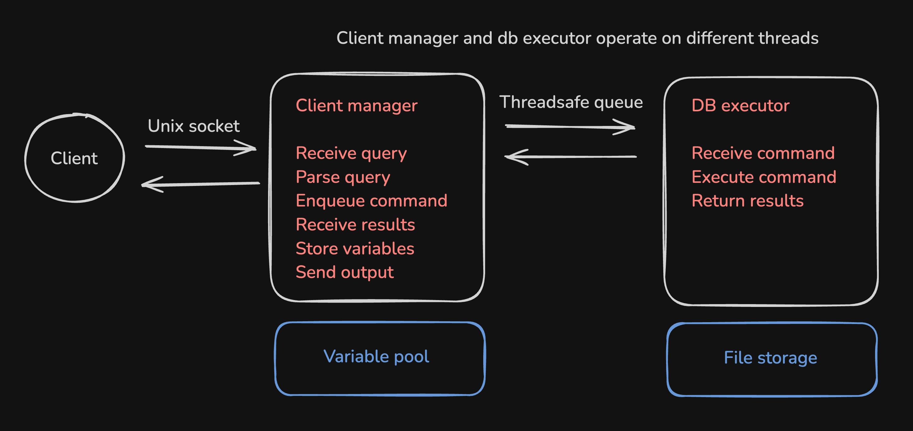
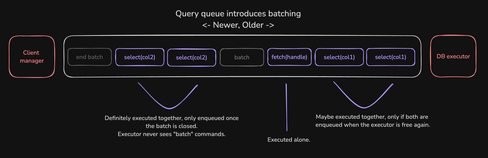
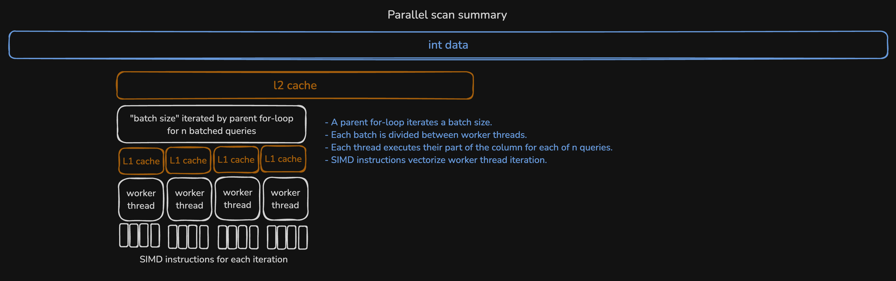

# Milestone 2

### Introduction

In milestone 2, I plan to optimize select and fetch operator runtime performance with command batching and parallelism. Introducing a command queue between the parser and executor will enable scan batching, and I'll use SIMD and multithreading to parallelize individual scan workloads.

### Problems

- CPU parallelism: Select and fetch should fully utilize SIMD and the instruction pipeline.
- Query batching: Scan operators should reuse work by sharing similar column traversals.
- Multi core parallelism: The DB should use all CPU cores when a full workload is present.

### Technical descriptions

- CPU parallelism
  - Modern CPUs support SIMD operations and benefit from unconditional iteration patterns. Scan operators should take advantage of these.
  - Carefully rewrite the select and fetch operators to minimize branching and use explicit SIMD instructions.
  - The details of this are still not clear to me. I anticipate a serious amount of consideration and work is needed to rewrite my operators with vector instructions, so this is a clear design decision but an unclear implementation one. I hesitate to invest heavily in it now because I assume it'll be affected by my multi-core parallelism changes.
- Query batching
  - Some queries may be very similar. For example, two consecutive select operators on the same column with different filters should only require column scan.
  - Upon receiving a message, the client parses the input and pushes it into a query queue. The executor runs each query from the queue and sends outputs into a response queue. When the executor encounters consecutive scans over the same data, it groups their execution into a single bulk operation. Scan operators that currently take one filter and return one output then must be updated to take many filters and return many outputs. This execution is closely related to the threading model described below.
- Multi core parallelism
  - Assume a host machine has 8 or more cores. All should be in use as long as the client is waiting.
  - Multithread in two places: (1) separate the i/o and parsing layer from the execution engine. They only need to communicate via input and output queues. (2) Use worker threads to parallelize individual chunks of data during a single column scan.
  - The barrier between client handler and execution engine should be such that an arbitrary number of client tasks can be added without serious architectural changes to the database (although I’ll only focus on one client at a time). This is advantageous because query parsing can be expensive, and it will basically never need to access the same data touched by the execution engine. The client thread is responsible for managing its own variable pool, so the execution engine will only interact with columns, bit vecs, int vecs, etc. Within the DB, a single operation will be executed at a time (scans, fetches, and aggregates of separate columns will happen sequentially). This is to avoid complexity regarding dependencies between queries. Executor parallelism will be used to speed individual scan performance. Each scan acquires the thread pool. The top level of the scan iterates large chunks of the underlying data. Each chunk will be divided between the worker threads, which will iterate their segment and write results for all queries in the current batch. Once all threads complete, the next chunk is executed. For example, assume a machine with a shared 4 mb L2 cache, 64 kb CPU-specific L1 caches, and 8 free CPU cores. A scan operator may iterate 128 kb at a time, assigning different 16 kb segments (4000 ints) to each worker thread. This ensures input and output for each core fit in L1, while the total data shared between cpus easily fits in L2. Minus synchronization overhead, this should yield a scan performance improvement roughly equal to the number of free cpus.

### Visuals

Distinct client-manager and db-executor threads:

Command queue enables batching similar scans (close up):

Scans use multi-core and cpu parallelization:

### Challenges

- Parallel spaghetti: I rewrote the plans above about three times, and I'll probably end up doing so again later. I want to introduce multithreading in a way that keeps my DB testable and comprehensible. I also want to structure my threading model such that (1) I still see performance gains even when queries aren't batched and (2) threads don't fight over cache space, undoing single-threaded cache awareness. Related, there may be race conditions intrinsic to my design that I'm not yet considering. Finding these late in the development process may seriously affect my timeline.
- CPU vectorization: I've never written SIMD instructions, and I'm not particularly familiar with branchless code execution. I'm guessing this will require a decent bit of profiling and experimentation. For that reason, I'll probably try this after figuring out multi thread execution to avoid needing to frequently refactor complex and sensitive code.
